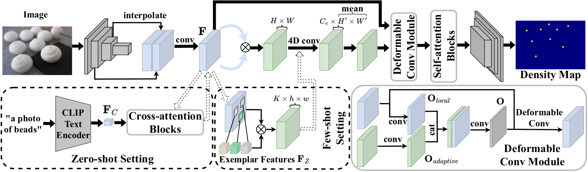

# A Generic Class-agnostic Object Counting Network with Adaptive Offset Deformable Convolution

# [[Homepage]()][[paper]()]

official code for paper "A Generic Class-agnostic Object Counting Network with Adaptive Offset Deformable Convolution"



# Requirement
The following python packages are required:
```
pytorch == 1.9.0
torchvision == 0.10.0
mmcv == 1.3.13
timm == 0.4.12
termcolor
yacs
einops
```

# Data Preparation

- Download [FSC-147](https://github.com/cvlab-stonybrook/LearningToCountEverything)
- modify the `root` in line 12 of `datasets/gendata384x576.py` to the local path of FSC-147.
- running the file `datasets/gendata384x576.py`

# Training

- modify your running environment in `./config.py`
- modify and run the file `./train.py`


# Citation


